# Datathon-Reviewer-Instructions

Thanks for being a reviewer and/or chair at Datathon 2019!

Note: if you see anything about "Meta-Reviewers" or "Senior Meta-Reviewers," please ignore that. We will only be using the regular "Reviewer" functionality in Microsoft CMT.

# Instructions for Reviewers

1. Log in to Microsoft CMT

2. Make sure that your "selected role" is "Reviewer" (see image below)

3. Your page should look like this:

4. Click the button to leave a review for one of the listed papers. The review page should come up:

5. Leave your review by answering the questions. After you submit, you can also edit your review, by selecting "Edit Review" on the same page

# Instructions for Chairs

Chairs have some additional abilities within the CMT system.

First, make sure you are in the "Chair" role:

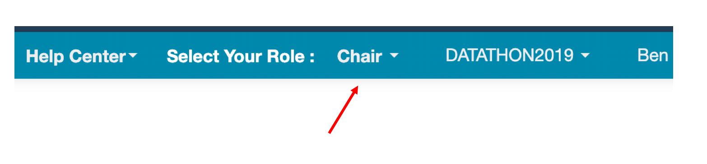

You will see a bunch of information in the Chair Console:

Here are the main things you need to know.

## Settings for Deadlines
1. Before participants can submit, and before reviewers can review papers, both of those functionalities (as well as some others) must be "enabled" in the Deadlines section of the Settings page. To get, there click on the following button:

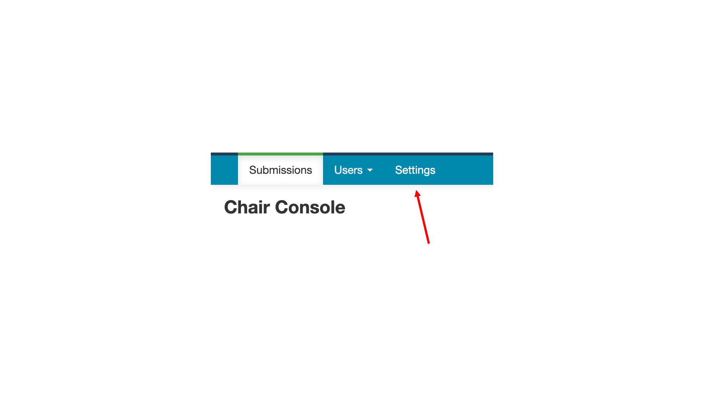

and then click on the Deadline button:

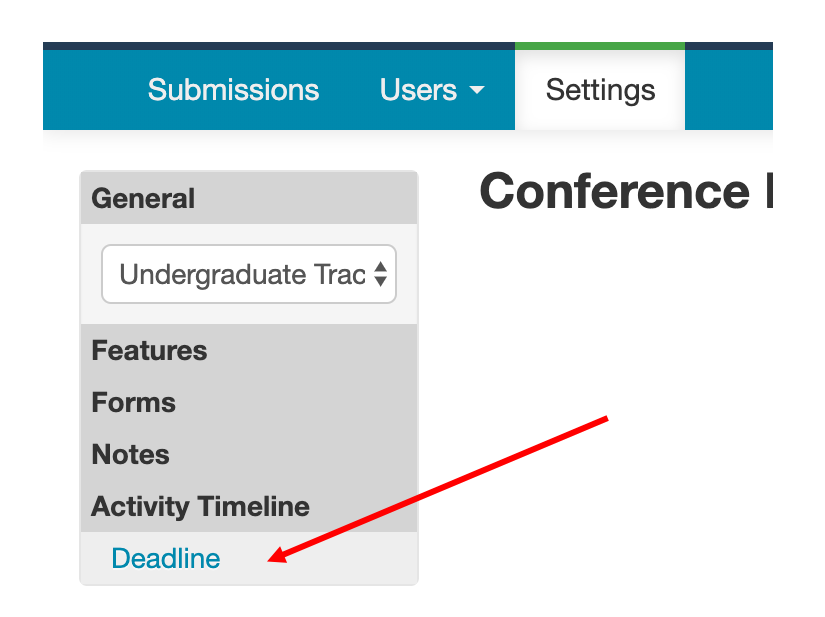

2. You can then set the relevant Deadline settings. An example is shown below:

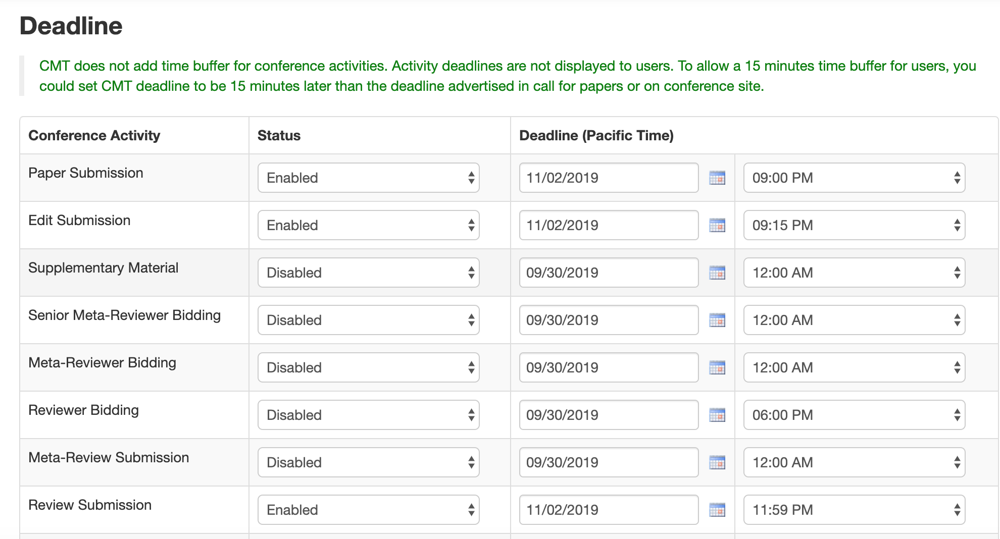

3. Make sure that these deadlines are correct. This affects if/when authors and reviewers can submit papers and/or reviews.

## Adding Questions for Reviewers

1. To add new questions for Reviewers to answer, stay in the Settings page (see above), and then select the button shown below:

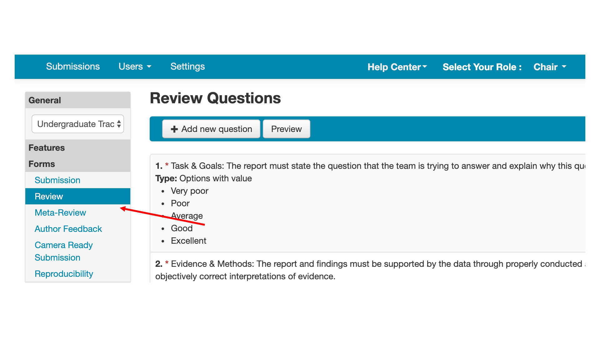

2. You can then add/remove questions for Reviewers

## Assigning Reviewers

There are two ways to assign reviewers:
1. Manually
2. Using the Automatic Assignment Wizard

*Manually*:

To do it manually, scroll to the far right side of the Chair Console, and then select the Edit Assignment button, and select Reviewer:

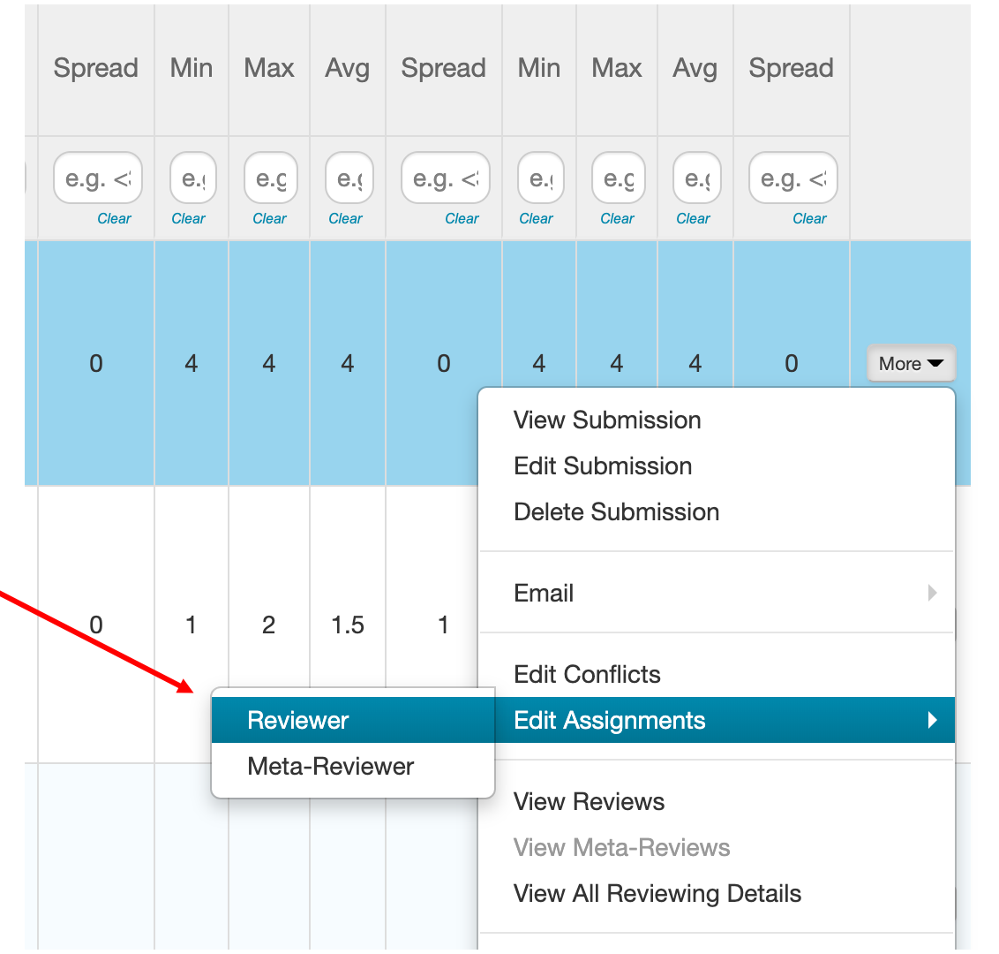

On the next page, it will then be easy to assign or unassign reviewers for each paper.

*Automatic Assignment Wizard*

Go to the top of the page, and select the following button:

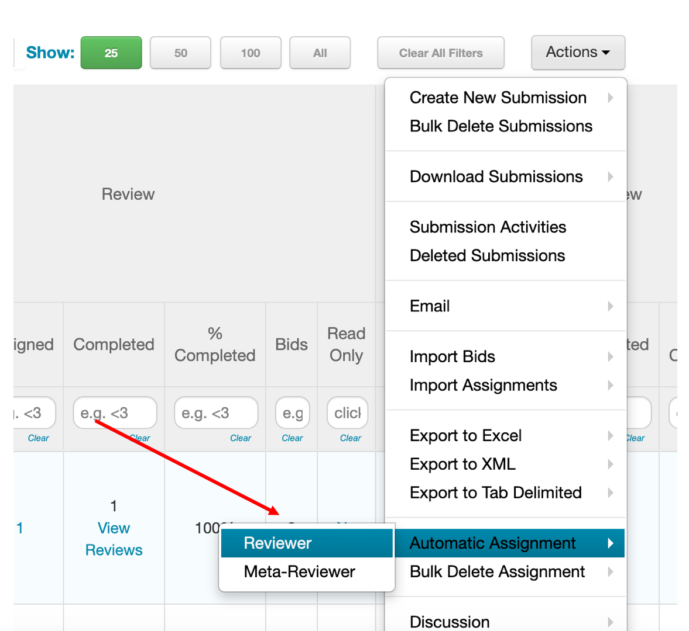

The following screen will come up:

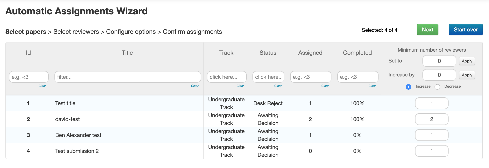

In the far right column, input the MINIMUM number of reviewers for each paper. Then, hit 'Next' in the top right of the screen.

On the next page, which looks like this:

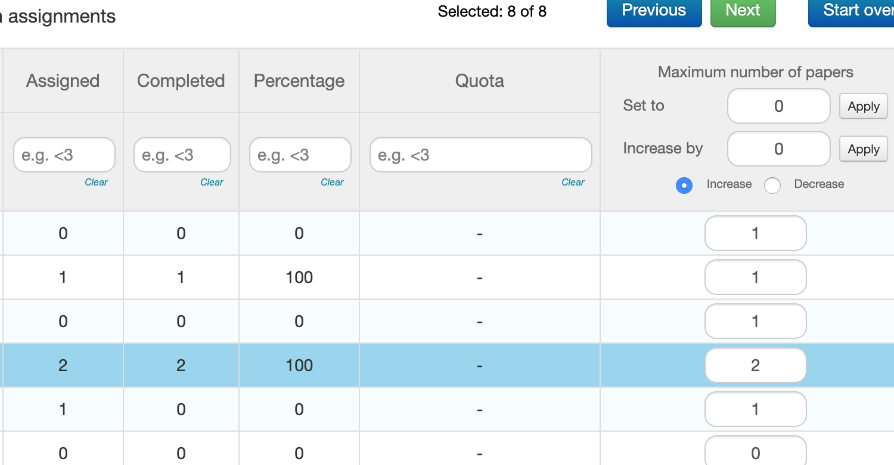

in the far right column, input the MAXIMUM number of papers for each reviewer. Then hit Next.

On the next page, simply click "Run Automatic Assignment" without changing any of the weights/Load Balanced options.

Then click "View Assignment Result"

The assignments will appear on the screen, like so:

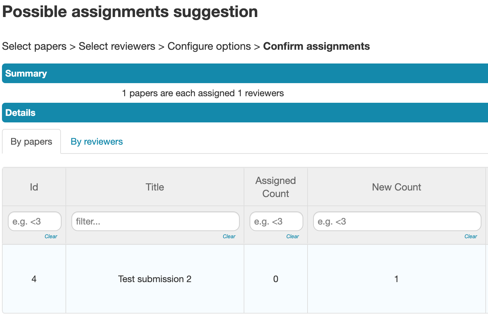

If everything looks good, make sure to click "Save Assignments" so that they are saved.

Now, when you return back to the Chair Console, you will see that reviewers have been assigned in the Reviewers column.

Reviewers can now review the papers by following the instructions in the "Instructions for Reviewers" Section of this document.

#### Downloading reviews

At the top of the page, you can download to Excel:

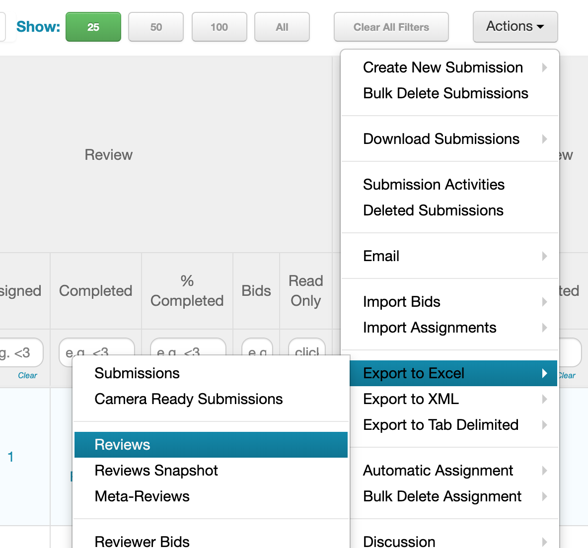
