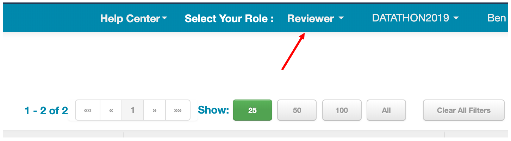
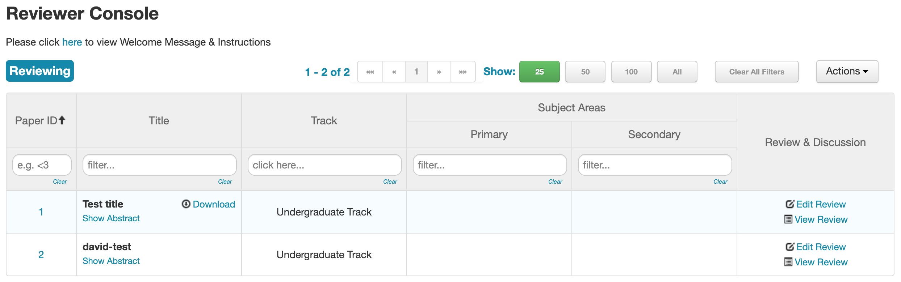
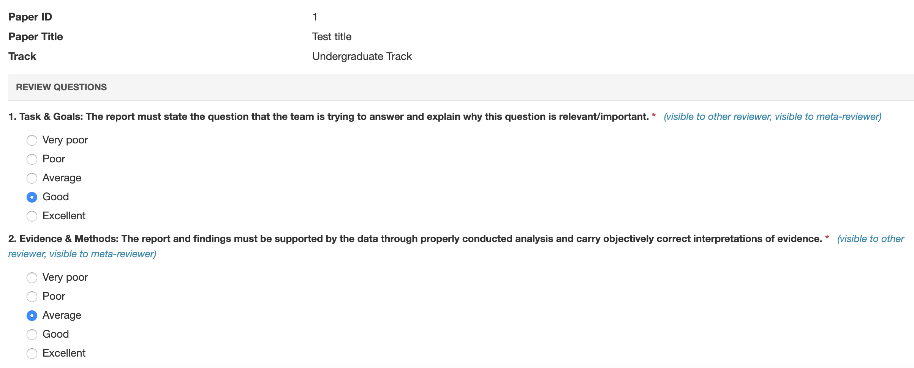

# Datathon-Reviewer-Instructions

Thanks for being a reviewer and/or chair at Datathon 2019!

Note: if you see anything about "Meta-Reviewers" or "Senior Meta-Reviewers," please ignore that. We will only be using the regular "Reviewer" functionality in Microsoft CMT.

### Instructions for Reviewers

1. Log in to Microsoft CMT

2. Make sure that your "selected role" is "Reviewer" (see image below)

3. Your page should look like this:

4. Click the button to leave a review for one of the listed papers. The review page should come up:

5. Leave your review by answering the questions. After you submit, you can also edit your review, by selecting "Edit Review" on the same page

### Instructions for Chairs
