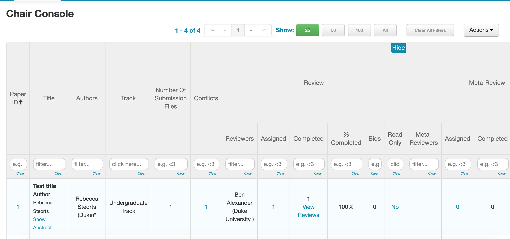
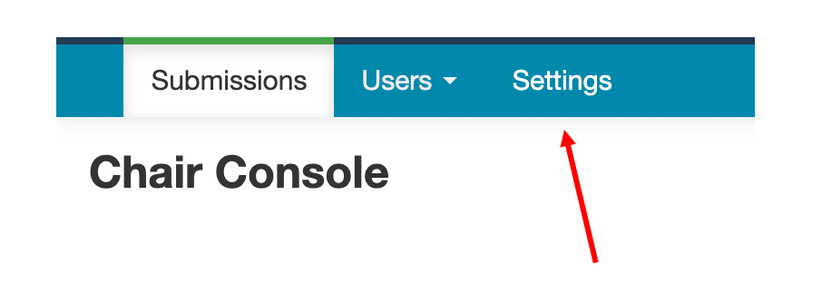

# Datathon-Reviewer-Instructions

Thanks for being a reviewer and/or chair at Datathon 2019!

Note: if you see anything about "Meta-Reviewers" or "Senior Meta-Reviewers," please ignore that. We will only be using the regular "Reviewer" functionality in Microsoft CMT.

# Instructions for Reviewers

1. Log in to Microsoft CMT

2. Make sure that your "selected role" is "Reviewer" (see image below)

3. Your page should look like this:

4. Click the button to leave a review for one of the listed papers. The review page should come up:

5. Leave your review by answering the questions. After you submit, you can also edit your review, by selecting "Edit Review" on the same page

# Instructions for Chairs

Chairs have some additional abilities within the CMT system.

First, make sure you are in the "Chair" role:

You will see a bunch of information in the Chair Console:

Here are the main things you need to know.

#### Settings for Deadlines
1. Before participants can submit, and before reviewers can review papers, both of those functionalities (as well as some others) must be "enabled" in the Deadlines section of the Settings page. To get, there click on the following button:

and then click on the Deadline button:

2. You can then set the relevant Deadline settings. An example is shown below:

3. Make sure that these deadlines are correct. This affects if/when authors and reviewers can submit papers and/or reviews.

#### Adding Questions for Reviewers

#### Assigning Reviewers

#### Downloading reviews
